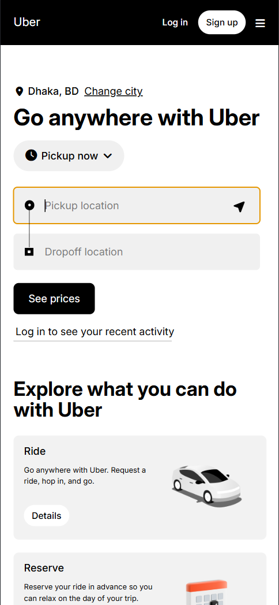
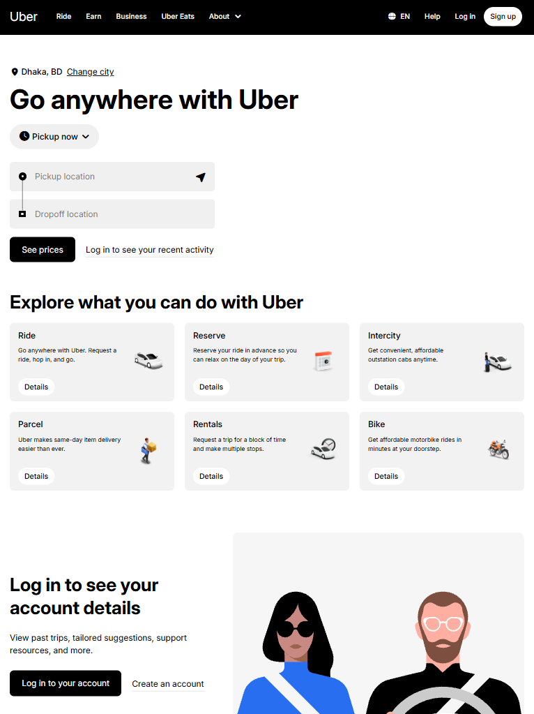
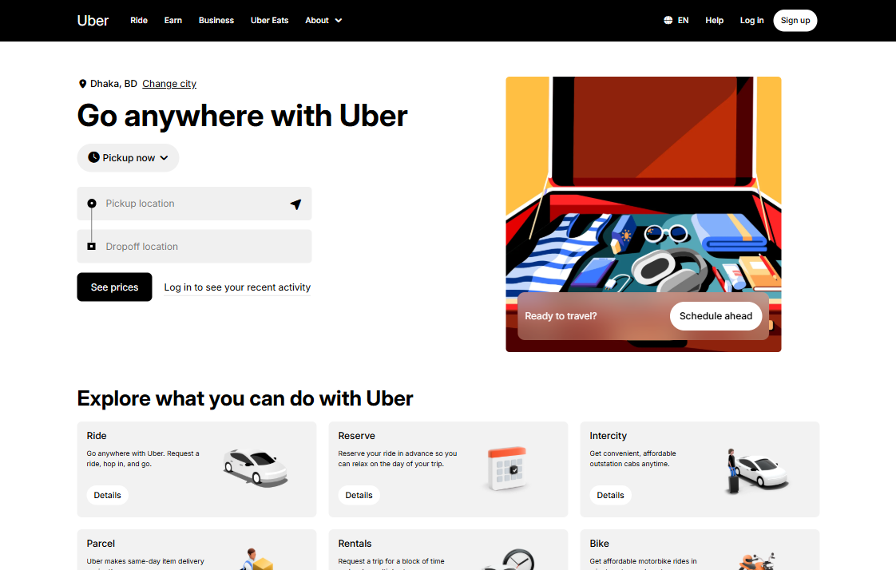

<h1 align="center">🚗 Uber Clone</h1>

**Started:** 08 June, 2026  
**Last Updated:** 10 June, 2026

A modern and responsive Uber clone built using only **HTML**, **CSS**, and **Tailwind CSS**. This project focuses on a sleek ride-hailing UI, an organized multi-category vehicle selection layout, and a polished digital booking experience without JavaScript or a backend.

---

## 🛠️ Technologies Used

| Technology | Usage                 |
| ---------- | --------------------- |
| HTML       | Structure and content |
| CSS        | Styling and layout    |
| Bootstrap  | Utility-First         |

---

## 📁 Project Structure

```text
uber-clone/                 # Project Name
├── assets/                 # Non-Code Files
│   ├── explore-images/     # Explore Section Images
│   ├── images/             # Base Images
├── README.md               # Project Documentations
├── index.html              # HTML Codes + Tailwind CSS Codes
└── style.css               # CSS Codes
```

## ✨ Features

- 📱 Fully responsive ride-hailing and delivery interface.
- 🗺️ Interactive hero section with a pickup and drop-off location form.
- 🚗 Multi-category vehicle grids (UberX, XL, Comfort) and service options.
- 💫 Smooth Tailwind transitions and hover states on interactive maps and cards.
- 🧭 Clean navigation layout with profile dropdowns and dynamic trip selectors.
- 🎨 Fully built with HTML, CSS, and Tailwind CSS utility classes.
- ⚡ Configured with custom Tailwind themes for easy branding updates.

---

## ⚠️ Challenges Faced

- **Static Functionality Limitations:** Replicating dynamic ride-hailing features like live map routing, vehicle selection highlights, and real-time price estimation using strictly static HTML and Tailwind utility classes without JavaScript.
- **Handling Vehicle Image Layouts:** Maintaining perfectly uniform vehicle fleet cards in the service selection section when using car renders with varying dimensions and transparent background aspect ratios.
- **Responsive Navigation Complexity:** Managing Uber's multi-layered header layout (location pickers, ride history, profile menus, and driving toggle) across smaller mobile screens using Tailwind’s arbitrary screen modifiers and flexbox grids.

---

## 🧠 What I Learned

- Building a visually appealing and intuitive ride-hailing interface.
- Organizing utility-first CSS classes within a frontend project for high maintainability.
- Implementing complex multi-item navigation headers using Tailwind CSS flexbox layouts.
- Designing responsive vehicle fleet grids and service selectors for various screen sizes.
- Customizing Tailwind themes and utility classes to match Uber's dark and minimal branding.

---

## 🖼️ Screenshot

<p align="center">
    <h4>1. Phone Screen:</h4>
    
</p>

<p align="center">
    <h4>2. Tab Screen:</h4>
    
</p>

<p align="center">
    <h4>3. Laptop or Desktop Screen:</h4>
    
</p>
